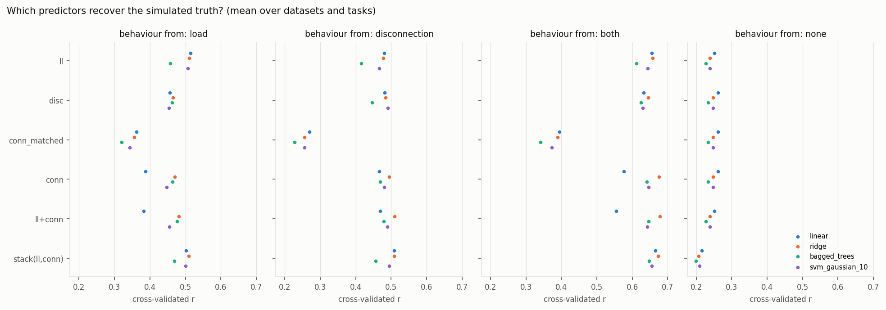

# disconnection: lesion load vs disconnection for predicting language after stroke

> Do measures of **structural disconnection** predict post-stroke language scores better than **regional lesion load**?

Disconnection here means ChaCo regional scores or edge-wise connection damage.

The code:

- cross-validates up to 19 regression models and 20 classifiers on several feature sets: demographics plus lesion load, connectivity, both, and stacks of them;
- compares lesion representations (binary vs fuzzy lesions);
- compares prediction errors between models with statistical tests.

The package bundles these experiments within one function, `compare_feature_sets`. Everything learned from data happens inside the cross-validation folds, and the statistical comparisons suit paired and repeated-CV data. The package also includes a synthetic "brain" in which the true source of the behavioural signal is known.

```
pip install -e .
pytest                                  # 73 tests on synthetic data (~2 min)
python -m disconnection compare data.csv --blocks dem=age,months,volume ll=ll_ disc=disc_ conn=conn_ \
       --targets naming repetition --models ridge bagged_trees --out results/
python -m disconnection benchmark --datasets 3 --out benchmark/
```

```python
from disconnection.compare import compare_feature_sets
from disconnection.features import STANDARD_SETS
blocks = {"dem": demographics, "ll": lesion_load, "conn": edge_disconnection}
sets = {"ll": STANDARD_SETS["ll"], "conn": STANDARD_SETS["conn"], "stack": ("stack", "ll", "conn")}
res = compare_feature_sets(blocks, scores, sets, models=["ridge", "bagged_trees"], k=10, repeats=5)
res.table                      # r, R2, RMSE, MAE per task x model x feature set
res.compare("ll", "conn")      # paired tests per task and model, Holm-corrected over tasks
```

## Package layout

| Module | Contents |
|---|---|
| `models.py` | The original regression "modes" 1–19 and classifier modes 1–20, by name or number (translation notes in the module), plus `ridge` |
| `features.py` | Predictor blocks and selection rules applied **inside** folds: `"all"`, `"bonferroni"`, `"bonferroni_or_p05"`, `"p05"`, `("top", k)`, `("match", block)`, `"perm"`; `STANDARD_SETS` |
| `cv.py` | Balanced, seeded folds shared by all models; repeated CV predictions; per-fold errors |
| `compare.py` | `compare_feature_sets`, properly nested stacking, `ResidualChain` (the hierarchical models), `ComparisonResults.compare` |
| `stats.py` | Pitman–Morgan and paired squared-error tests, the 5×2cv F-test, the Nadeau–Bengio corrected t-test, Fisher/Meng/Steiger–Zou correlation comparisons, Holm |
| `selection.py` | Stepwise selection by CV, best subsets, PLS backward elimination, nested selection CV |
| `classify.py` | Impaired vs unimpaired classification, with class balancing inside each training fold |
| `learning.py` | Learning curves; stability of PLS scores (sign-aligned) |
| `multivariate.py` | Prediction from principal components of a whole-brain map, with covariates adjusted inside the folds |
| `data.py` | Loading ChaCo `.mat` files, the patient selections of MakeRegMatrices.m, long-format data for mixed models |
| `synthetic.py` | Toy brain: parcellation, curved streamlines, spherical lesions; binary and fuzzy lesion load, ChaCo, edge disconnection; behaviour from load, disconnection, both, or neither |
| `benchmark.py` | The representation benchmark and the pitfall experiments below |

## Synthetic benchmark

The benchmark ran:

- 3 datasets of 200 patients for each ground truth (impairment caused by load in white matter versus disconnection), with 2 tasks each;
- 10-fold CV;
- four models (least squares, ridge, bagged trees, Gaussian SVM).

Each number below is the mean cross-validated r over models, datasets and tasks. Full tables are in `benchmark/`.

| behaviour simulated from | ll | disc | conn | ll+conn | stack(ll,conn) | conn_matched |
|---|---|---|---|---|---|---|
| lesion load | **0.50** | 0.46 | 0.44 | 0.45 | 0.50 | 0.35 |
| disconnection | 0.46 | 0.48 | 0.48 | **0.49** | **0.49** | 0.25 |
| both | 0.64 | 0.63 | 0.64 | 0.63 | **0.66** | 0.37 |
| neither (demographics only) | 0.24 | 0.25 | 0.25 | 0.24 | 0.21 | 0.25 |



- **The two representations are hard to tell apart.** In the simulation, lesion load and disconnection correlate at r ≈ 0.8. That is typical, because the same lesion produces both. So even when behaviour is generated *only* from disconnection, lesion load predicts almost as well:
  - Cross-validated r rose only from 0.46 to 0.48–0.49.
  - Averaged over models, squared error was no better with connectivity alone (−1%). Only the stack of lesion load and connectivity helped (+4%).
  - Connectivity was significantly better than lesion load (Holm-corrected) in only 25% of comparisons at n = 200.
  
  A null result for disconnection at this sample size says little.
- **A win for one representation is not proof of mechanism.** With flexible models (bagged trees), connectivity features did as well as lesion load even when behaviour came from lesion load. Each representation partly encodes the other.
- **The framework does not invent advantages.**
  - When lesion load is the truth, connectivity was 13% worse in squared error on average; linear models favoured lesion load clearly.
  - With no brain signal, all sets perform the same.
- **The "matched" connectivity set was always the worst.** It restricts connectivity to as many features as survive Bonferroni correction for lesion load, which is usually very few. This design, used in all the stacking scripts, handicaps connectivity.
- **Model choice matters as much as representation.** Least squares on hundreds of correlated connection features overfits (r 0.39 vs 0.47 for ridge on the same features, when behaviour came from lesion load). Ridge, not in the original set of models, was among the best throughout.

